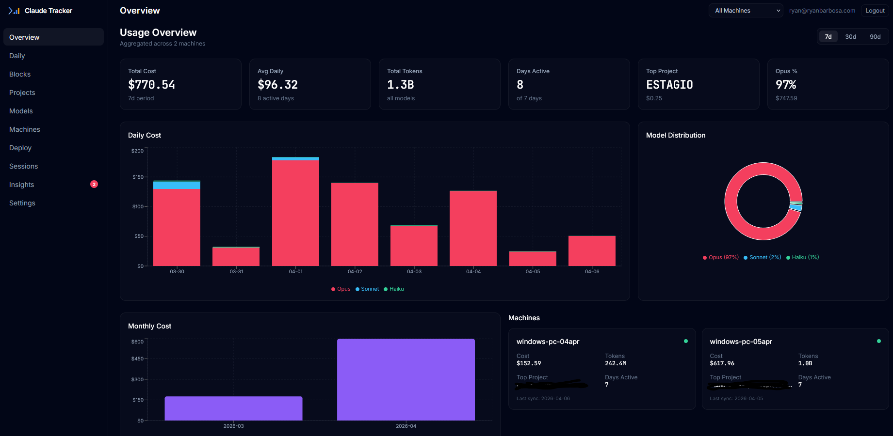
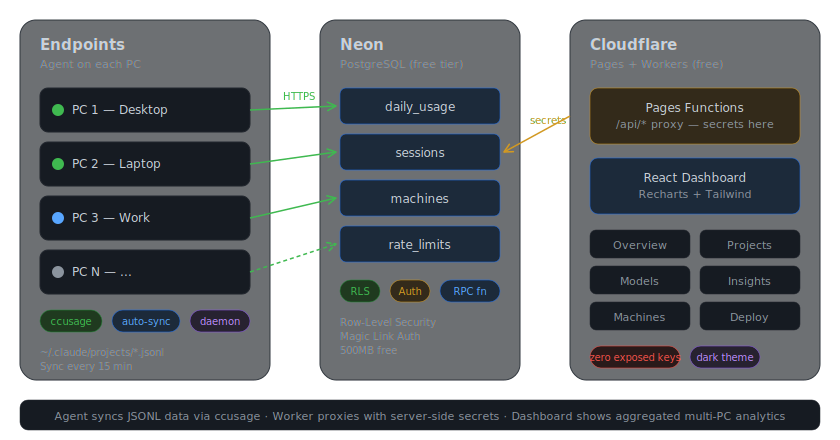

<div align="center">


# claude-telemetry



**Centralized Claude Code usage tracking across multiple PCs**

[](LICENSE)
[](https://python.org)
[](https://react.dev)
[](https://pages.cloudflare.com)
[](https://pypi.org/project/cc-telemetry/)

</div>

---

## What is this?

CLI tools like [ccusage](https://github.com/ryoppippi/ccusage) and ccost are single-machine. If you use Claude Code across multiple PCs, you have no unified view of your total spending.

**claude-telemetry** solves this with an Elastic/Wazuh-style architecture: a lightweight Python agent on each PC auto-syncs usage data to a central Supabase database, and a React dashboard shows everything aggregated with filters by machine, project, model, and time period.

The agent does **no custom JSONL parsing** — it calls `ccusage` as the parsing/pricing layer and focuses only on multi-PC aggregation and centralized sync.

## Features

- Multi-PC aggregation with per-machine tracking
- Auto-sync daemon (Elastic/Wazuh style agent)
- Dark-mode dashboard with interactive charts (Recharts)
- **5-hour block tracking** with active block card, burn rate, and multi-PC timeline
- **Plan vs API cost comparison** (Pro/Max 5x/Max 20x/Custom)
- **Rate limit progress bars** (5-hour + weekly windows)
- **Usage pace calculator** with trend detection
- **Project budget tracker** with alerts at 90%/100%
- **Weekly usage reports** with daily/weekly toggle
- Cross-machine usage pace comparison
- Model mix analysis (Opus/Sonnet/Haiku breakdown)
- Supabase Auth (magic link login) with email whitelist
- Cloudflare Workers proxy (zero exposed keys in frontend)
- Deploy page with copy-paste agent install commands
- Statusline auto-setup for rate limit tracking
- Export data as CSV/JSON
- Uses existing tools (ccusage) — no custom JSONL parsing
- **Real-time hooks** — instant sync on session end (SessionEnd + Stop hooks)
- **MCP server** with 12 tools — query usage data directly from Claude Code
- **Insights Engine** — trend analysis, anomaly detection, cost forecasting, period comparison
- **Webhook notifications** — Discord/Slack alerts for budget and rate limit thresholds
- **Setup wizard** (`cc-telemetry setup`) — one command configures hooks, MCP, statusline, daemon
- **Doctor** (`cc-telemetry doctor`) — 10-point health check for all components

## Quick Start

### Step 1 — Supabase (free tier)

1. Create account at [supabase.com](https://supabase.com)
2. New Project — choose name and region
3. SQL Editor — paste and run each migration in order:
   1. [`supabase/migrations/001_initial_schema.sql`](supabase/migrations/001_initial_schema.sql)
   2. [`supabase/migrations/002_stats_extra_unique.sql`](supabase/migrations/002_stats_extra_unique.sql)
   3. [`supabase/migrations/003_user_preferences.sql`](supabase/migrations/003_user_preferences.sql)
   4. [`supabase/migrations/004_blocks.sql`](supabase/migrations/004_blocks.sql)
   5. [`supabase/migrations/005_notifications.sql`](supabase/migrations/005_notifications.sql)
4. Authentication > URL Configuration:
   - **Site URL:** `https://your-app.pages.dev`
   - **Redirect URLs:** add same URL
5. Settings > API — copy **Project URL** and **service_role key**

### Step 2 — Dashboard (Cloudflare Pages)

```bash
git clone https://github.com/seosieve/claude-telemetry.git
cd claude-telemetry/dashboard
npm install
npx wrangler pages project create claude-telemetry
npx wrangler pages secret put SUPABASE_URL        # paste Project URL
npx wrangler pages secret put SUPABASE_SERVICE_KEY # paste service_role key
npx wrangler pages secret put ALLOWED_EMAILS       # e.g. "you@email.com,friend@email.com"
npx wrangler pages secret put CRON_SECRET          # random string for webhook cron auth
npm run build
npx wrangler pages deploy dist
```

### Step 3 — Agent (each PC)

```bash
# Prerequisites
npm install -g ccusage ccost

# Install
pip install cc-telemetry

# Setup wizard (configures hooks, MCP, statusline, daemon — all in one)
cc-telemetry setup

# Verify
cc-telemetry doctor
```

<details>
<summary>Alternative: install from source</summary>

```bash
git clone https://github.com/seosieve/claude-telemetry.git
cd claude-telemetry/agent
python3 -m venv venv
source venv/bin/activate  # Windows: .\venv\Scripts\Activate
pip install -e .
cc-telemetry setup
```
</details>

## Architecture



## Dashboard Pages

| Page | Description |
|---|---|
| **Overview** | Total cost, daily chart, model pie, machine cards, plan savings, rate limits |
| **Daily** | Stacked area chart with daily/weekly toggle, top 10 days, hour heatmap |
| **Blocks** | 5-hour block timeline, active block card, burn rate, multi-PC table |
| **Projects** | Cost by project, pie distribution, budget progress bars, full table |
| **Models** | Opus/Sonnet/Haiku breakdown, mix over time, savings alert |
| **Machines** | Per-machine cards, comparison chart, daily pace, status badges |
| **Deploy** | Generate agent install commands with one-click copy, statusline setup |
| **Sessions** | Paginated table with sorting, filters by machine/project/type |
| **Insights** | Plan value, burn rate, rate limits, budgets, trend analysis, cross-machine |
| **Settings** | Plan selection, project budgets, alert thresholds, machine management, export |

## CLI Reference

**Setup**

| Command | Description |
|---|---|
| `cc-telemetry setup` | Setup wizard — configure everything in one command |
| `cc-telemetry doctor` | Health check — verify all components |
| `cc-telemetry setup-hooks` | Configure real-time sync hooks |
| `cc-telemetry setup-mcp` | Register MCP server with Claude Code |
| `cc-telemetry setup-statusline` | Configure rate limit tracking |

**Operation**

| Command | Description |
|---|---|
| `cc-telemetry sync` | Manual sync to Supabase |
| `cc-telemetry sync --verbose` | Sync with detailed output |
| `cc-telemetry sync --force` | Re-sync all data |
| `cc-telemetry status` | Show config and last sync |
| `cc-telemetry local --daily` | View local data without syncing |

**Service**

| Command | Description |
|---|---|
| `cc-telemetry daemon` | Run auto-sync in foreground |
| `cc-telemetry install-service` | Install as system service |
| `cc-telemetry uninstall-service` | Remove system service |
| `cc-telemetry service-status` | Check daemon status |

**Cleanup**

| Command | Description |
|---|---|
| `cc-telemetry uninstall` | Remove agent config from this machine |

## Security

- **Dashboard access**: Only emails listed in `ALLOWED_EMAILS` can log in. Set via:
  ```bash
  npx wrangler pages secret put ALLOWED_EMAILS
  # value: "you@email.com" or "you@email.com,teammate@email.com"
  ```
- **API proxy**: All Supabase keys are server-side only (Cloudflare Workers). Zero secrets in the browser bundle.
- **Agent auth**: Each machine uses a unique API key stored locally in `~/.claude-telemetry/config.json`.
- **RLS**: Row-Level Security ensures each user only sees their own machines and data.

## Uninstall

To completely remove claude-telemetry from all services:

**Step 1 — Remove agent (each PC)**

```bash
# Stop and remove the service
cc-telemetry uninstall-service

# Remove config and data
cc-telemetry uninstall

# Or manually:
# Windows: rd /s /q %USERPROFILE%\.claude-telemetry
# Linux/macOS: rm -rf ~/.claude-telemetry

# Remove the package
pip uninstall cc-telemetry
# Delete the repo folder
```

**Step 2 — Delete Cloudflare Pages**

```bash
npx wrangler pages project delete claude-telemetry
# Or: Cloudflare Dashboard > Workers & Pages > claude-telemetry > Settings > Delete project
```

**Step 3 — Delete Supabase project**

Supabase Dashboard > Project Settings > General > Delete project.
This permanently deletes all data.

After these 3 steps, nothing remains — no data, no services, no secrets.

## Tech Stack

| Component | Technology | Hosting |
|---|---|---|
| Agent | Python 3.11+, ccusage | Local (each PC) |
| Dashboard | React 18, Vite, TailwindCSS, Recharts | Cloudflare Pages |
| Database | PostgreSQL | Supabase (free tier) |
| Auth | Magic Link | Supabase Auth |
| API Proxy | Pages Functions | Cloudflare Workers |

## Releases

See [GitHub Releases](https://github.com/seosieve/claude-telemetry/releases) for changelog.

## License

MIT — see [LICENSE](LICENSE)

## Credits

A fork of [claude-telemetry](https://github.com/RyanTech00/claude-telemetry) by Ryan Barbosa, adapted by [seosieve](https://github.com/seosieve).
